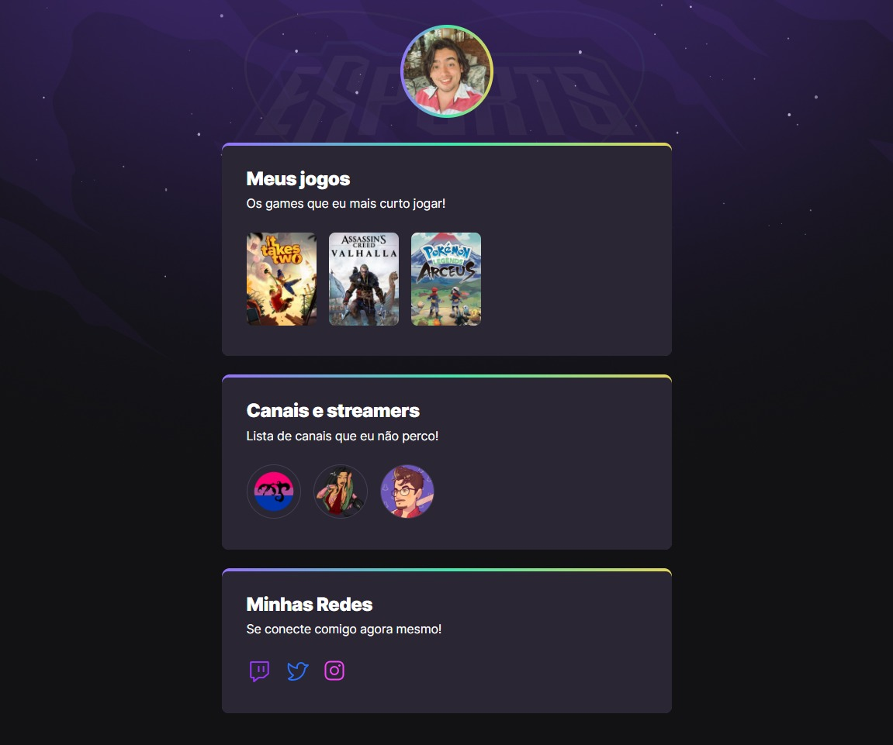

<h1 align="center">
  LinkTree eSports
</h1>

  
   

  <a href="#-Technologies">Technologies</a>&nbsp;&nbsp;&nbsp;|&nbsp;&nbsp;&nbsp;
  <a href="#-Project">Project</a>

 

  

## 🚀 Technologies

This project was developed with the following technologies:

- HTML
- CSS

## 💻 Project

The project is a hub of links related to the world of eSports and was developed at Rocketseat's Next Level Week (NLW) event.

To access the project, click [here!](https://d-henrique.github.io/ExplorerLinktreeESport/)

---

Made with ♥ by Doug Moreira and Rocketseat :wave: [Join our community!](https://discordapp.com/invite/gCRAFhc)
